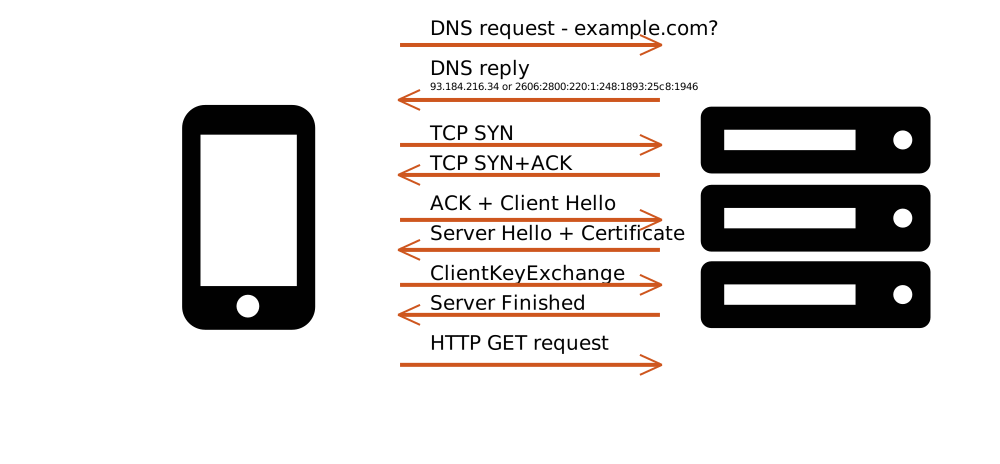

<link rel=stylesheet href=style.css>

# Delivering Ideal Site Performance

--------------------------------

What does it take to deliver web sites in the highest performing way
possible? What would it take for us to say that given certain bandwidth,
latency and CPU constraints, a web site was delivered to the user at the
best possible speed?

This is a question I’ve spent a lot of time on in the last few
years, thinking about what ideal performance would take, on the
browser side as well as on the server/content side.

Ideal performance would require many different conditions in order to
happen:

* Early delivery - Content delivery needs to start as soon as possible.
* Priorities - Critical content is delivered before less-critical.
* Full bandwidth pipe - The network bandwidth must be fully used at all
times until no content delivery is required.
* Full CPU use - The CPU and the browser’s main thread should be
fully used, as long as processing is required to transform the delivered
content into pixels on the screen, application behavior, and application
logic.
* No CPU Blocking - At the same time, the browser’s main thread should not be blocked by
long execution tasks at any point in the loading process, in order to
remain responsive to user input.
* Minimal Content - No unnecessary content should be sent to the user and required content should be highly compressed.
* Contention avoidance - Bandwidth and CPU contention should be avoided
between low priority content and high priority, as well as between
same priority resources which need to be processed in their entirety.
* Minimize latency impact - Use a content delivery network (CDN) and improve content caching at the
  client.
* Control - Make sure that content and in particular third party content
does not get in the way of your user's experience.
* Measurement - Making sure that all the above conditions are in fact true
and perform as expected.

This chapter will explore strategies for satisfying these conditions
in order to avoid unnecessary delays when delivering assets on
the web. These
conditions may require changes in the way browsers load web
content. However, they cannot rely solely on that. For some of
these conditions to be met, web content must also be adjusted.

At the same time, due to limitations in size, this chapter won’t be able to cover all the conditions above.
Specifically, we'll focus on the ins and outs of resource loading and leave aside CPU use, main-thread blocking
avoidance and performance measurement.

But before we dive into the details of the different resource loading
phases and how they can be improved, let’s take a short detour to
examine the browser’s resource loading processes.

## How browsers load resources
A typical web page is built from multiple resource types and often many resources
that make sure the user's visual experience is a pleasant one.

The HTML resource gives the browser the structure of the
document, CSS styles the document and JavaScript provides
functionality and interactivity. Beyond those, fonts make sure the
reading experience is optimal, and image, video and audio resources
provide visuals as well as the audio often required to convey the
full context of the page.

But all these resources are not declared in a single place when the
browser initially fetches the HTML, when the user clicks on a link or
types something into their address bar. All the browser has to go on at that
point is the HTML itself, and only once fetched does it know of
some of the other resources required for the full site experience.

So what happens when the browser navigates to a new page?

First, the browser starts the connection establishment process, using
DNS to know which host to connect to, and then establishing TCP and TLS
connections to that host. That process usually takes around 4
round-trip times. Then, it sends out a GET request for the HTML itself, and
receives an initial buffer of the response from the server.
The size of that response depends both on the HTML size and the initial
congestion window of the server. A typical value for that is window is
10 packets of 1460 bytes, or around 14KB of data.

### HTML processing

One of the great things about HTML as a format is that it's
progressive. It can be processed as it comes off the network, so
even if the HTML the browser has is incomplete (as is often the case),
the parts that have already arrived can be processed and acted on.

Now, the browser needs to process that HTML to start building the DOM tree from it, and most importantly for our resource-loading interests, to figure out which
resources are needed for it to fully construct and render the page. The
HTML processing phase starts by the tokenization phase - 
The browser breaks apart the HTML string into tokens, where each token
represents a tag start, tag end, or the text between the tags.

The tokens are a data
structure representation of the HTML's text, bringing it one step closer
to something that can be properly handled by the HTML parser.
They might represent invalid HTML, as the example below. That is expected, as
it's not the tokenizer's role to enforce HTML parsing rules.

<figure>

<figcaption>Invalid HTML gets tokenized - the `</img>` tag creates an
"EndTag" token, despite it being invalid.</figcaption>
</figure>

After the tokenization phase, the browser can start using those tokens
to kick off resource loads. Since blocking scripts can cause
the DOM creation, it's better not to wait to load resources until the DOM is
ready.
Instead, the browser uses its [preloader][preloader] to
scan through the tokens and figure out which resources are highly likely to be requested later on, and kick off those requests ahead of time.

After the preloader runs its course, the browser uses those same tokens and parses
them according to HTML's parsing rules.  The result is
DOM nodes, interconnected as a DOM tree.
Any tokens which represent
invalid markup will be processed and used to create a perfectly valid DOM.

[preloader]: https://calendar.perfplanet.com/2013/big-bad-preloader/

### The critical rendering path
We've seen how the browser discovers resources, but not all
resources are created equal. In particular there's a set of resources
the browser requires to initially render the web page's
content.

We talked about the creation of the DOM tree, and it is
required for the browser to be able to render the page to
screen, but unfortunately it is not sufficient. To render the page with its appropriate styling to the
user (and avoiding a "Flash of unstyled content"), the browser also
needs to create the render tree and in most cases the CSS Object Model.

<aside>
The CSS Object Model (CSSOM) is a set of APIs that
enable scripts to examine the styles of various DOM nodes, as well as
setting them to change their appearance.
</aside>

To create both the CSSOM and the render tree, the browser needs
to download all the external CSS resources and evaluate them. Then it
processes those downloaded rules, along with
any inline style tags and style attributes to calculate which
styles (if any) are applied to each node in the DOM tree.

This is where blocking scripts come in. Blocking scripts (as their
name suggests) block HTML parsing as soon as they are encountered, and
HTML parsing does not continue until they finish being downloaded,
parsed and executed. Furthermore, in many cases at least, they cannot
start executing until all CSS that preceded them has been
downloaded and processed.

The reason is that those scripts can access the bits of the DOM
that are already generated and query their CSSOM. If they do that, the
CSSOM state must be stable and complete. Hence browsers must make sure
this is the case, and they do that by downloading and processing
all CSS before any CSSOM reads. The result can be a lot of delay
to JavaScript execution, which in turn delays DOM creation. Sadness.

To top all that, this is applicable to external blocking
scripts as well as inline ones. Inline scripts can and will block
your HTML processing if they are preceded by external stylesheets.

Now, once the browser has built a sufficiently large DOM tree and calculated the styles for each DOM node, it can
walk over the DOM and create the render tree, by creating an equivalent
tree for each node that actually partakes in the page's rendering and is
displayed on screen.

After that, the browser can proceed to laying out the different elements
on the screen and eventually paint them.


### Request destination and credentials mode

One important thing to understand about loaded resources in the browser
is that each request has its own destination as well as credentials
mode.

#### Request destination
The request's [destination][destination] indicates what "type" of resource we're
expecting to receive from the server and how that resource will be used.
Different destinations include "style", "script", "image", "font"
and more. A requests' destination has several implications for resource
loading. As we'll discuss later, it determines the priority
of the request. It is also used in various internal caches in the
browser to make sure a previous response can be served to a current
request only when their destinations match.

#### Credentials mode

A request's [credentials mode][credentials] determines whether the request gets
credentials information (cookies in the typical case) sent along with it
to the server. Possible values can be:

* "include": a request will have credentials
* "omit": it will not have credentials
* "same origin": a request will have credentials only
  when sent to the same origin.

Each resource type may have a different credentials mode by default.
Resource fetches triggered by `` and `<script>` will have a default
credentials mode of "include" by default, while font fetches will have a
"same origin" credentials mode. `fetch()` calls used to have a default
"omit" mode, but recently changed to "same origin".

All that to say, as a performance-aware web developer, you need to
pay close attention to the credentials mode of the resources you're loading.

In markup, developers can also change the credentials mode of the
resources they load by including the [`crossorigin`][crossorigin] attribute, which
modifies the default for markup-based resource fetches:

* "anonymous" or an empty value indicates a "same origin" credentials
  mode.
* "use-credentials" indicates an "include" credentials mode.

Note that there's no current value which results in an "omit"
credentials mode.

[credentials]: https://fetch.spec.whatwg.org/#concept-request-credentials-mode
[destination]: https://fetch.spec.whatwg.org/#concept-request-destination
[crossorigin]: https://html.spec.whatwg.org/multipage/urls-and-fetching.html#cors-settings-attributes

Why does the credentials mode matter?

First of all, you may expect cookies on the server for a certain
request and understanding credentials mode will help you understand when
they'd be there and when they would not be.

Otherwise, like the request
destination, the credentials mode determines if a request and a response
can be matched in the browser's internal caches. On top of that, some
browsers (most notably Chrome) will use separate connections for
requests of different credential modes. We'll expand later on the impact of
that.

### All set?

With a better understanding of the way browsers load resources,
let’s now take a look at the different conditions required to make
loading as fast as possible.

# Early Delivery

When it comes to web performance, our goal is usually seemingly obvious:
we want _meaningful_ content to be accessible as quickly as possible. As
part of that, we need resources on the critical path to be delivered early.

 How early is early enough? Probably shortly after the browser sent out a request for
it, typically after the user clicked on a link or typed something in
their address bar. (Or even before that, if the application can have high
enough confidence that they would — e.g. when the user moves their mouse pointer within
a certain proximity of a button)

## Protocol overhead
Network protocols introduce overhead to network communication. That
overhead is manifested in extra bytes - while most of our network
traffic is content, some part of it is just protocol information
enabling the delivery of that content.
But the overhead is also manifested in time - establishing a connection
or passing along critical information from client to server or vice
versa can take multiple round-trip times (RTTs), resulting in those
parts of the delivery being highly influenced by the network's latency.

The consequence is a delay until the point where the browser
starts receiving the response from the server (also known as
time to first byte, TTFB). Recent
advances in the underlying protocols make that less of an issue, and
can reduce TTFB significantly.

### 0-RTT
In their non-cutting-edge versions, the DNS, TCP and TLS protocols require a large number of
RTTs before the server is able to start delivering useful data.



Protocol advancements such as Quick UDP Internet Connection (QUIC) on the one hand and TCP-Fast-Open
(TFO) and TLS 1.3 on the other, made most of that obsolete. These protocols
rely on previously established connections to keep cryptographic
"cookies" that remember past sessions, and allow previous sessions to be
recreated instantaneously.
There are still many caveats and many scenarios where the connection
will take more than a single RTT to be established, but generally, using those cutting edge protocols
will mean there are very few RTTs to get in the way of delivering content to our users.

<aside>

#### QUIC - Quick UDP Internet Connection

HTTP/2 brought many necessary improvements to resource
delivery over HTTP. HTTP/1 it had a severe head-of-line blocking
issue, where the browser could send in practice only one request at
a time on a connection. That created a linear relationship between the
number of requests a page had and the number of RTTs it took for the
page's resources to be downloaded. As a result, browsers settled on
opening multiple connections per host (typically 6 connections for
modern browsers) to reduce the latency by a fixed factor.

HTTP/2 fixed that head-of-line blocking issue by enabling multiplexing of multiple request and
responses over a single connection, without incurring extra latency
costs per request. As a result, browsers only use a single
connection per host with HTTP/2. But a side effect of that is that HTTP/2 delivery
is more sensitive to packet losses than HTTP/1, as each packet loss
affects *all* the resources, rather than just one of them.

As a result, in highly-lossy environments, there are scenarios where
HTTP/2 ends up being slower than HTTP/1, making the switch to HTTP/2
tricky for sites that have large chunks of their audiences coming in from
poor networking environments.

To resolve that, the Google Chrome team started exploring ways to
make the transport layer more aware of HTTP/2's request-response streams.
Since TCP is widely deployed and inspected by intermediary network
components, it's practically impossible to significantly change the
protocol without some of those network components breaking that traffic
in the process. Re-implementing a reliable transport layer over a
different transport protocol – the User Datagram Protocol (UDP) – was a simpler option.

The result is QUIC - a new
protocol combining the transport, encryption and application layers
into a single, coordinated processing model.

This new protocol has several shiny new improvements over the protocols
of yore:

* 0-RTT - combining layers means the protocol needs to
  establish a connection only once (for both transport and encryption
layers). On top of that, once a user has established a connection to a
server, the client can remember those encryption credentials and
resume that same connection in the future with 0-RTTs (sending those
past-credentials along with the request).
* Stream-aware loss handling - Another major advantage of merging the
  layers is in handling packet losses. Both TCP and QUIC offer
reliable transport, which means when a packet is lost, it has to be
successfully retransmitted before the subsequent packets can be delivered
to higher layers. However, TCP guarantees reliable delivery for the
entire connection, while QUIC guarantees reliable delivery *per
request-response stream*. That means a packet loss in QUIC will only delay the affected resources, while one in HTTP/2 over TCP will
delay *all resources*.
* Tighter prioritization - Because QUIC is implemented over UDP, the
  transport layer logic and queues are all implemented in the server in userland code, rather than in the kernel, where TCP's logic is implemented.
As a result, it's easier for the server to have tighter controls over
the priorities of the resources currently in the sending
queues. One of the problems with the HTTP/2 over TCP model is that the
TCP queues are outside of the server's control. When the server
sends down a mix of resources of different priorities, there can be
situations where the TCP queues already contain not-yet-sent lower priority
resources, which will then delay the high-priority resource from being
sent. With QUIC, a server implementation can have tighter control over
the queues and make sure that lower priority resources don't get in the
way.

QUIC is not yet a standard protocol. It is only implemented as part of
the Chromium project's network stack, and used as a library by Chromium, Android apps as well as servers.
At the same time, there are significant efforts at the Internet Engineering Task
Force (IETF) to create a standard version of the protocol, so it can be implemented independently in an interoperable way across multiple browsers and servers.
</aside>

### Preconnect

While 0-RTT protocols enable us to forgo the four typical RTTs it takes
the browser to establish a connection, preconnect enables us to get them
out of the browser’s critical path. Preconnect is a markup hint which
indicates to the browser that resources would be downloaded from a
certain origin, so the browser would do well to resolve that host’s
address, and create TCP and TLS connections to it ahead of time, before
the resource is actually needed.

Preconnect is expressed as a rel attribute on a <link> element. For
example, 
`<link rel=preconnect href="https://www.example.com">` tells the browser
to create a connection to the host `www.example.com` even if it hasn’t
encountered any resources on that host just yet.

### Adaptive congestion window
When the server starts sending data to the user, it doesn't know how much bandwidth it will have for that purpose. It can't be sure what
amount of data will overwhelm the network and cause congestion. Since
the implications of congestion can be severe, a mechanism called _slow start_ was developed to make sure it does not happen.
It enables the server to gradually discover the connection's limits, by starting to send a small amount of packets, and increasing that exponentially.
But owing to its nature, slow start also limits the amount of data that we can initially send on a new connection.

<aside>
#### Congestion collapse
The reason slow start is needed is to avoid congestion collapse.

Let's imagine a situation where the server is sending down significantly more packets
than the network can effectively deliver or buffer. Many
or even most of these packets will get dropped. And what do reliable
protocols do when packets are dropped? They retransmit them!

So now the server is trying to send all the retransmits for the dropped
packets, but they are *still* more than the network can handle, so they
get dropped.

What does the helpful transport layer do? You guessed it, retransmit
again.

That process happens over and over, and we end up with a network
passing along mostly retransmits and very little useful information.

This is the reason it pays off to be conservative, start with a small
number of packets and go up from there.
</aside>

In the past the recommended amount of packets for the initial congestion
window - the initial amount of packets the server can send on a fresh
connection - was [somewhere between two and four, depending on their
size][initcwnd_2].

[initcwnd_2]: https://tools.ietf.org/html/rfc3390

In 2013 a group of researchers at Google ran experiments all over
the world with different congestion windows and [reached the
conclusion][initcwnd_10] that this value can be lifted to ten.

[initcwnd_10]: https://tools.ietf.org/html/rfc6928

If you're familiar with the rule stating you should send all critical content in the first
14 KB of HTML, that's the rule's origin. Since
the maximum ethernet packet size is 1,460 bytes of payload, 10 packets
(or approximately 14 KB) can be delivered during that first initial congestion window.
Those packets need to include both the headers and the critical content
payload if you want your site to reach first paint without requiring
extra round-trips.

However, in many cases the network can
handle significantly more than that. The server may know that when the
connection is over a network it has seen before.

The browser itself can also, in many cases, take an educated guess
regarding the quality of the network it's on. It can base that on
the network radio type and signal strength, as well as past browsing
sessions on that network.

Browsers already expose network information to JavaScript through the [Network Information API][netinfo], and there's work underway
to expose the same information using Client-Hints. That will enable
servers to modify their initial congestion window based on the [effective
connection type][ect] and adapt it according to the browser's estimate.
That would help to significantly minimize the time it takes the
connection to converge on its final congestion window value.

[netinfo]: https://wicg.github.io/netinfo/

The advent of QUIC as the transport protocol will also make this easier
to implement on the server, as there's no easy way to increase the
congestion window for an in-flight connection in TCP implementations today.

[ect]: https://wicg.github.io/netinfo/#-dfn-effectiveconnectiontype-dfn-enum

### What to do?

How can you make sure that you're minimizing your protocol overhead?
That depends on your server's network stack.
Moving to QUIC, TLS 1.3 or TFO may require upgrading your server's network stack, or
turning on those capabilities in its configuration. Alternatively, you can use a CDN that supports those protocols, and have servers which sit between your users and your servers.

These protocol enhancements are all relatively new, so support may not be widespread at the moment.
QUIC, specifically, is still not standardized, so it can be hard to self-deploy, since that would require frequent updates as the Chrome
implementation evolves.
At the same time, keeping an eye on these protocols and taking
advantage of them once they become available can be beneficial.

Alternatively, it is easier to turn on preconnect for your critical third-party hosts,
by adding `<link rel=preconnect href=example.com>` to your markup. One
caveat here is that preconnects are cheap, but not free. Some browsers
have a limited number of DNS requests that can be up in the air (Chrome limits pending DNS requests to six, for instance).

Preconnecting to non-critical hosts can use up your quota and prevent
connections to other hosts from taking place. Only preconnect to
hosts your browser would need to preconnect to, and prefer to do that
roughly in the same order as the browser would use those connections.

When using preconnect, you also need to pay close attention to the
credentials mode of the resources will use that connection. Since Chrome
uses different connections for different credential mode requests, you
need to let the browser know which connection type it needs to
preconnect to. You can do that with the `crossorigin` attribute on the
preconnect `<link>` element.

And as far as the adaptive congestion window goes, that requires some more
server-side smarts, but hopefully with the advent of network info in
Client Hints and QUIC, we can imagine servers implementing that scheme.

## Server-side processing
The other hurdle to overcome when it comes to early delivery is server-side processing. HTML content is often dynamic and, as such, generated on
the server rather than simply delivered by it. The logic for its generation
can be complex, might involve database access, and can also include
different APIs from different services. That processing is also often
done using interpreted languages such as Python and Ruby, which are not
always the fastest choice, at least not by default.

As a result, generating the HTML once a request has hit our servers is a
time-consuming activity, and one which wastes our users' time. Worse
than that, it is time spent before the browser can do anything to
advance the loading of the page.

### Early Flush
One way to avoid forcing our users to wait for our potentially slow
database responses is to flush the HTML's `<head>` early on. As part of the HTML
generation process we can make sure that once the `<head>` is ready, it will be sent to the browser, enabling it
to start processing it, issue the requests defined in it, and
create the relevant DOM tree.

However, that is not always feasible in practice. Depending on your
application logic, there are a few problematic aspects about
flushing your HTML content early.

#### Committing an HTTP response code

When flushing HTML content early, you are committing to a certain HTTP response code, typically 200 OK. But the eventual response may end up having a different status code,
perhaps a 404 or a 500 error if the server failed to find the required information in the database. In such a case, you would have
to redirect or modify the content using JavaScript, to show the error. But because that content was served with a 200 response code, search engines may not recognize it as error content, and that error content may find itself
in search results. It also means we need to bake that eventual error logic into our
client-side application logic, in order to make sure the negative user impact of
that redirection is as unnoticeable as it can be.

#### Dynamic response header logic
Any dynamic logic applied to the response headers must be applied
ahead of time. Header-based cookies, Content Security Policy directives, and other header-based instructions have to be
determined before the first content flush. In some cases that
can delay early flushing of content; in others it can prevent it
entirely (for example, if the cookie that is supposed to be set
comes from a database).

Alternatively, you can try to build in application logic that converts
these header-based browser instructions into content-based ones (like
setting the cookies using JavaScript, or setting some headers using meta tags as part of
the content itself).

#### Compression buffering
Even if your application logic enables early flushing of your HTML's `<head>`,
misguided gzip or Brotli settings can result in undesired buffering. When done wrong, they can
nullify your attempts to send content early to the browser. Gzip and
Brotli have various settings to control the trade-off between
buffering content and compression ratio: the more buffering, the better
compression ratio these algorithms can achieve, but at the cost of extra
delays. When flushing early, you should make sure that your server (and
whatever other components applying compression in your infrastructure) is set accordingly.

[Gzip][gzip_manual]'s default buffering mode is `Z_NO_FLUSH`, which
means it buffers data until it considers it has enough to create
ideal compression output. Setting it to `Z_SYNC_FLUSH` can ensure that
every input buffer creates an output buffer, trading off some
compression ratio for speed.

If you're using on-the-fly Brotli to compress your content, there's a
similar flag in the streaming Brotli encoder, called
[`BROTLI_OPERATION_FLUSH`][brotli_flush], you should use instead of
the default.

[gzip_manual]: https://www.zlib.net/manual.html
[brotli_flush]: https://github.com/google/brotli/blob/1e7ea1d8e61b7cd51149a2dd491bc86ff8ef460c/c/include/brotli/encode.h#L90

### Server Push
Another way to work around slow server-side processing is to use an
HTTP/2 (or H2 for short) mechanism called _Server Push_ to load critical resources
while the HTML is generated.

That often means by the time the HTML is generated and starting to
be sent to the browser, the browser already has all the critical
resources in its cache.
Furthermore, sending those critical resources starts the TCP
slow start process earlier and ramps up TCP's congestion window. When
the HTML is finally ready, a significantly larger part of it can be sent down.
<figure>

<figcaption>Loading process without Push: HTML download and slow start
kick off only after HTML is generated.</figcaption>
</figure>
<figure>

<figcaption>Loading process with Push: critical resources and slow start
kick off before HTML is generated, so once it is ready it can be sent
down in a single RTT.</figcaption>
</figure>

One of the biggest problems with Server Push today is that the server
cannot see into the browser's cache state, so when done naively
the server is likely to send down resources that the browser already
has.

A recent proposal called [Cache Digests][digests] aims to solve that, by
sending the server a condensed list of all the resources the browser has
in its cache for that particular host, enabling the server to take that
into consideration before pushing down resources.

[digests]: https://tools.ietf.org/html/draft-ietf-httpbis-cache-digest-04

In practice, because of the caching issues, you don't want to use Server
Push naively.
One easy way to implement Server Push is to make sure it's only in
effect on your landing pages, and only working for first views.
You can use a cookie to distinguish first views from repeat visits, and
use the request's `Accept` headers to distinguish navigation requests
from subresource ones.

Actually triggering Server Push varies per server: some servers use Link
preload headers as a signal to push resources. The problem with that
approach is it doesn't take advantage of the server's think time.
Alternatively, configuring the server to issue pushes based
on the arriving requests can prove more beneficial, as it triggers the
push earlier.

If you want to go all in, there's also a [service worker-based
implementation of Cache Digests][cachedigestsjs], which can help you
deliver Push on all your pages today, without waiting for Cache Digests
to be standardized and implemented.

[cachedigestsjs]: https://github.com/h2o/cache-digest.js/blob/master/README.md

### Early Hints
Yet another alternative is a newly adopted HTTP standard header called
[Early Hints][early_hints] (assigned with the response number 103).
This header enables the server to send an initial set of headers that
will be indications regarding the resources a browser should load,
while still not locking down the final response code.
That would enable servers to send down Link preconnect and preload
headers in order to tell the browser as early as possible which
hosts to connect to and which resources to start downloading.

The main downside here is that Early Hints is not yet implemented by any
browser, and its implementation may not be trivial. Because the hints
are received before the final HTTP response, the browser doesn't
necessarily have in place the rendering engine process that will end up
processing that document. So supporting Early Hints would require
supporting a new kind of request that is not necessarily triggered by
the rendering engine, and potentially a new kind of cache that will keep
these resources around until the rendering engine is set up and has received
the final headers and document.

[early_hints]: https://tools.ietf.org/html/rfc8297

### Prefetch
Finally, there's also the option of working around the server's think
time by kicking it off significantly earlier, before the user has even expressed
explicit interest in the page.
Browsers use past user activity to predict where the user is
likely to go next and prefetch those pages while they are typing in the
address, or even before that.

`<link rel=prefetch>` is an explicit way in which developers can do the
same and tell the browser to start fetching an HTML page or critical
resources ahead of time, based on application knowledge.

Those fetches remain alive when the user actually navigates to the next
page, and remain in the cache for a limited amount of time even if the
resource is not cacheable.

If you make a reasonable guess of where your users will head
next, prefetch can be a good way to make sure that when they do, the
browser will be one step ahead of them.

# Priorities
Since the download process of a web page comprises downloading
dozens of resources (and sometimes more), properly managing the download priority of these
resources is extremely important. We discussed the resource loading
process earlier. Part of that process is determining each resource’s
priority.


## Request priorities

Once the browser detects a resource that it needs to load, it kicks off
a request that will fetch that resource.
We saw earlier that some requests may be more important than
others. Resources that are in the critical path should ideally reach
the browser before those that are not, and that are
required at a later phase of the rendering process.

How do browsers make sure these critical requests get higher
priority over less critical ones?

We'll talk about more sophisticated priority schemes later, but if we
look at HTTP/1.X, the only method for browsers to control the priority
of a specific request is by… not sending it up to the server in the
first place. Browsers have a queue of requests that were discovered
but should not yet be sent up to the server because there are more
critical resources in flight, and we don't want the less critical ones
to contend on bandwidth with them.

Different browsers use different schemes: some hold off all
non-critical requests while critical ones are in progress, while others
let through some non-critical requests to go out in parallel to critical
ones, to improve image performance.

Browsers assign priorities to resources according to their type (strictly speaking, according to their `Request.destination`).
In the priority queue model, they make sure that a request doesn't go
out to the network before higher-priority requests.

Typically, browsers will assign higher priorities to rendering-critical resources. In Chrome, that translates into the following order:
HTML, CSS, fonts, JavaScript, in-viewport images, out-of-viewport images.
Chrome also follows some further heuristics which go beyond what other
browsers typically do:

* Blocking scripts at the bottom of the page
  are of lower priority than blocking scripts at the top of the
page.
* Async and defer scripts are of even lower priority.
* Preloaded fonts get slightly lower priority than late-discovered
  fonts to prevent them contending with render blocking resources.

The purpose of these heuristics is to try to infer the developer's
intent from various existing signals: the location of the resource on
the page, whether it is a blocking resource, and so on.
However, such an approach has its limits, and it's hard for developers
to convey their real intent to the browser.

Which is why we need…

## Priority Hints
We've seen before that browsers assign different priorities to different
resource types based on various heuristics. But as much as these
heuristics have done well over the years to optimize content download,
they are not always accurate, and are based on indirect
indications from the developer regarding which resources are most
important for their site. The [Priority Hints][priority_hints] proposal
is an attempt to make those indications explicit, and let
browsers take action based on them.

The proposal aims for developers to include new "importance" attributes
to various resource-downloading HTML elements, which will indicate
whether the resource's priority should be upgraded or downgraded.

That would clearly signal to browsers how to prioritize a resource
against its counterparts, without binding them to direct developer
instructions, which may not be accurate; for example, a blocking script with
"low" importance attribute value is still blocking layout, and therefore should not have
its priority downgraded.

At the time of writing, the proposal is to add an `importance`
attribute on `<link>`, ``, `<script>` and `<iframe>` elements, with
possible values of `low` and `high`. The hints will enable developers to
inform the browser about low priority resources (such as non-critical JavaScript)
as well as high-priority ones (like hero images).

A similar parameter will also be added to the `fetch()` API options,
enabling setting the hint on dynamically generated requests.

[priority_hints]: https://wicg.github.io/priority-hints/

## Stream internal priorities

One of the assumptions behind HTTP/2's prioritization scheme is that
every resource has its priority. And that assumption works well for
resources that have to be processed as a whole, such as CSS and
JavaScript. Such resources are either critical or not, in their
entirety.

However, for streaming resource types, such as HTML and images, that
assumption doesn't necessarily hold.

If we consider HTML, its first few bytes, which contain the `<head>`,
enable the document to be committed, and the critical resources to be
requested are of the highest priority. At the same time, especially for
long HTML files that go beyond the initial viewport, the last few bytes
required to finish constructing the DOM, but not required
for the initial rendering, are of lower priority.

Similarly, the first bytes of images, which contain the image's
dimensions are extremely important as they enable browsers to reserve
space for the image and allow layout to stabilize.
For progressive images, the byte range containing the
first scan is significantly more important than the last bytes of the
last scan. The former enable the browser to display the rough image (in
low quality), while the latter provides small quality improvements.

So download schemes that would enable us to download the first scans of
all in-viewport images provide a significantly better user experience
than ones which download images one by one.


<!-- Credit John Mellor -->

Currently, HTTP/2 priorities don't enable us to include such
prioritization schemes in the protocol.
And even if it did, there's currently no way for browsers to know
the exact byte ranges of the various images before starting to
download them.
But that's potentially something we could improve in the future.
In the meantime, smart servers could do it by overriding the
priorities sent by the browser.

# Delivering the right content at the right time
Since browsers discover content progressively, and content has
different priorities, it is important to make sure the application
including the content loads the right content at the right time, and critical and non-critical content are not
mixed together.

## CSS - critical and non-critical
Loading only the critical parts of your CSS up front, while lazy-loading
the rest can be one of the highest impact optimizations
you can apply to speed up your first paint and first meaningful paint
rendering metrics.

Your CSS can probably be divided into three parts:

* Critical CSS: CSS required to style elements present in
  the initial viewport.
* Non-critical CSS: CSS required to style elements outside of the
  initial viewport or in other parts of your site.
* Unused CSS: CSS rules not used anywhere on your site.

With the advent of front-end CSS frameworks, such as Bootstrap, many
sites are downloading significantly more CSS than they actually use.
More often than not, they are loading it up front, by simply adding `<link
rel="stylesheet">` tags into their markup.

When the browser's preloader sees such tags, or when the equivalent
elements get added to the browser's DOM tree, this CSS is downloaded at
a high priority as it is considered critical.

Because of the cascade, before it can be processed to calculate the page's styles, the complete CSS
code needs to be parsed and taken into account. That includes not just
the CSS from a single file, but from all of your included CSS files - at
least the ones in your document's `<head>`.
The reason is that any CSS rule down at the bottom of your CSS
can override any rule at the top of it, so to know which rules
actually apply, all your CSS has to be processed.

Therefore it is highly recommended that you only deliver upfront your
critical CSS: the CSS absolutely necessary for your page's initial render.
All other CSS should be loaded asynchronously, in a way that doesn't
block rendering.

And obviously, it's best to avoid sending down CSS you simply won't need.

### How to deliver critical CSS
What's the best way to send critical CSS to the browser?

The simplest option is to include a `<link rel="stylesheet">`
tag in your markup and let the browser discover the CSS file and
download it. While that works, it's not the fastest option. The browser
has to tokenize the HTML to start that download, which means an
extra RTT plus some processing time before it starts.

Another option is to inline critical CSS into your HTML so it
will get delivered as part of the same resource, saving an RTT.
That's a better option, especially if your critical CSS is fairly small.
At the same time, your caching will suffer. Delivering the CSS inline
means you'll be sending it for every repeat
visit to every page on your site. If the CSS is small enough, it could be
worth your while, but it's a trade-off you should be aware of.

A third option is to use H2 Push to deliver critical CSS before your
HTML even hits the browser.

### How to deliver non-critical CSS
We've seen that adding CSS to your
your HTML with `<link rel="stylesheet">` causes browsers to think it
is blocking and hold off rendering until it's fully downloaded and
processed. How do we avoid that?

#### Using `requestAnimationFrame` as a First-Paint Proxy
One technique to make sure you don't load any non-critical CSS before the initial page
render is to trigger the loading of that CSS only after the render
happens. While there's no direct event that fires when the initial
render happens, the [first requestAnimationFrame event][first_raf] of the page
corresponds to it pretty well.

Loading CSS at that point will not block the page's
initial rendering, so it will have no negative side effect.

```
    var loadStyle = () => {
        var link = document.createElement("link");
        link.rel = "stylesheet";
        link.href = "non-critical.css";
        document.body.appendChild(link);
    };
    if (window.requestAnimationFrame) {
        window.requestAnimationFrame(() => {
            window.setTimeout(loadStyle, 0);
        }
    } else {
        window.addEventListener("DOMContentLoaded", loadStyle);
    }
```
<!-- Credit Google Developers documentation for the example -->

[first_raf]: https://developers.google.com/speed/docs/insights/OptimizeCSSDelivery
#### preload

An alternative technique to decouple CSS execution from
loading is to use `<link rel="preload">` to trigger the CSS
loading, and only process it and take its rules into account once it's
loaded. To do that, we can take advantage of
HTMLLinkElement's `load` event.

`<link rel="preload" as="style" href="async_style.css" onload="this.rel='stylesheet'">`

<!-- Credit Scott Jehl for original technique -->

You can also combine the two methods above to trigger a
download of the preload resource, only after the document has been painted.
This avoids having it contend for bandwidth with more critical
resources.

The downside of these two methods is that the resource will be
downloaded with high priority, so it runs a real risk of competing 
with other resources on the page.

#### Inapplicable media attribute
Another way to cause an early download of a CSS resource without
triggering its execution is to use the `media` attribute of
`HTMLLinkElement` with the `stylesheet` `rel` attribute.
Such resources are downloaded at a lower priority,
yet not executed until the download has finished.

An example may look something like this:
`<link rel="stylesheet" href="async_style.css" media="not all" onload="this.media='all'">`

#### Progressive CSS loading
The above methods all work but are not necessarily easy to use, as they
require extra work to load your CSS in a performant way.

What if we could change the way CSS behaves to make it easier to
progressively load, and have it only block the rendering of the
contents below it?

That would let us [load our CSS whenever we actually need
it][link_in_body], and browsers would just do the right thing.

Up until recently, that was (more or less) the way Firefox, Safari, and
Edge loaded CSS, but not Chrome. Chrome and other Chromium-based
browsers blocked the rendering of the entire page as soon as an external
CSS resource was discovered, even if it was in the `<body>`. That meant
using this technique would have had a significant performance penalty in
Chrome.

But starting from Chrome 69, Chrome aligned its behavior with other
browsers. Developers can now include non-critical CSS, using `<link
rel="stylesheet">` tags inside their content, without it having a negative
impact.

One caveat is that Firefox doesn't always block rendering for
in-`<body>`
style sheets, which can result in a flash of unstyled content (or FOUC). A
way to work around that is to include a non-empty `<script>` tag after the
`<link>` tag, which forces Firefox to block rendering at that point until
all styles have finished downloading.

An example of the above would be:
```html
<html>
  <head>
  <style>/* Critical styles */</style>
  </head>
  <body>
  <!-- Critical content -->
  <link rel="stylesheet" href="foo.css">
  <script> </script><!-- Note the space inside the script -->
  <!-- Content which is styled by foo.css -->
  </body>
</html>
```

A future improvement might be for browsers to adapt the CSS priority to
its location, as it turns it from a render-blocking resource to a
partial blocker.

[link_in_body]: https://jakearchibald.com/2016/link-in-body/
<!-- Credit Jake Archibald and Pat Meenan for research, technique and implementation -->

#### Which one should I use?
We've discussed four techniques to load CSS, but when should you
use each one?

These techniques differ in the time in which requests are triggered,
as well as in the request’s priority. Also, some of them rely on script
execution which, some argue, goes against the principles of
progressive enhancement.

In the end, I believe the easiest and cleanest technique to load
non-critical styles that may be needed further down the page is to
include them as `<link>` tags in the `<body>`, and have them block only the
content that relies on them.
If you have styles that are needed only for follow-up pages, you could use
the inapplicable media technique, but arguably `<link rel="prefetch">` may
be a better tool for the job.

## JavaScript - critical and non-critical
Like CSS, blocking JavaScript also holds off rendering. Unlike
CSS, JavaScript [processing][cost_js] is significantly more expensive than CSS
and its render-blocking execution can be arbitrarily long.

On top of that, non-blocking async JavaScript can also block rendering
in some cases, which we'll discuss further down.

At the same time, in many cases, JavaScript is responsible for
engaging user experiences on the web, so we cannot wean ourselves off it
completely.

What's the middle ground? How can we enable performant JavaScript experiences?
Advice here actually varies, depending on the role of JavaScript in your
web app.

[cost_js]: https://medium.com/dev-channel/the-cost-of-javascript-84009f51e99e

### JavaScript Enhanced experience - AKA Progressive Enhancement
Earlier we talked about the advantages of HTML as a
streaming format. This might be considered an old-school opinion, but
to create the highest-performing web experience, it is often
better to build your application's foundations as HTML and (minimal)
CSS, and then later enhance it with JavaScript for improved user
experience.

You don't have to shy away from fancy JavaScript-based
animations, or avoid dynamic updates to your content using JavaScript. But
if you can make your initial loading experience not dependent on
JavaScript, it is highly likely that it will be faster.

I'm not going to go into details regarding writing progressively
enhanced web apps – this is well-documented elsewhere.
I'm also not going to argue with the fact that in some cases, JavaScript
is mandatory and progressive enhancement makes little sense.

But if you're delivering content that the user then interacts with, it's 
likely better for you to deliver that content as
HTML, and then enhance it with JavaScript.

#### How to Progressively Load JavaScript
If you follow the principles of progressive enhancement, you want to
load your JavaScript in a non-blocking way, but still want enhancements to
be there relatively early on. More often than not, the web platform's
native mechanisms to load scripts will not be your friends. We talked at
length about blocking scripts and why they're bad, so you can probably
guess they are not the way to go. But what should you do?

#### Why Not async?

First, let's talk about what you shouldn't do. `async` is an attribute
on the `<script>` element that enables it to be non-blocking, download in
parallel to other resources, and run whenever it arrives at the browser.

While that sounds great in theory, in practice it can result in race
conditions and have performance implications:

* `async` scripts run whenever they arrive. That means they can run out of order so must not have any dependencies on any other script in the page.
* Because they run whenever they arrive, they can run either before or
  after the page is first painted, depending on network conditions and
network optimizations. This creates a paradox: optimizing your async
scripts (better compress them or make sure they arrive earlier using
Server Push or preload) can often result in performance regressions!
Arriving sooner to the browser means their parsing and execution
(which on mobile can be hefty) is now [render-blocking][souders_async], even though their
download was not.

For that reason, `async` is not a great download mechanism, and should be
avoided most of the time.

One more thing: to even consider making certain scripts
asynchronous, those scripts must avoid using APIs such as `document.write`,
which require blocking the parser at the point in which the script is
injected. They should also avoid assuming the DOM or the CSSOM are in a
specific state when they run. (Avoid, for example, appending nodes to the
bottom of the `<body>` element, or relying on certain styles to be applied)

[souders_async]: https://calendar.perfplanet.com/2016/prefer-defer-over-async/

#### Defer
As far as native script mechanisms go, that leaves us with the `defer`
attribute. `defer` has the following characteristics:

* A deferred script will download without blocking the rendering of the page.
* Deferred scripts run at a particular point in time: after the DOM
  tree is complete and before the DOMContentLoaded event fires. That
means they run after all inline scripts, and can depend on them.
* Deferred scripts execute in the order they are included in the
  document, which makes it easier to have dependencies between them.

`defer` is a reasonable way to make sure scripts will not interfere
with the page's first render, but those scripts will delay the browser's
DOMContentLoaded event (which triggers JQuery's `ready()` callback). Depending on your app, that may be problematic if you rely on user visible functionality to hang off of that event.

In terms of priorities, in Chromium, both `async` and `defer` scripts are
(at the time of writing) downloaded with low priority,
similar to images. In other browsers, such as Safari and Firefox,
that's not necessarily the case, and deferred and asynchronous scripts have the
same priority as blocking scripts.

Similar limitations apply to deferred scripts as asynchronous: they
cannot include `document.write()` or rely on DOM/CSSOM state when they
run – even though the latter is less restrictive, as there are
guarantees that they'd run right before DOMContentLoaded and in order.

<aside>
Using `&lt;script defer>` only became a realistic option in the last few
years.
IE9 and earlier had a fatal issue with it, causing content that used `defer`
to be [racily broken][ie9_defer] if the scripts actually had
interdependencies. Depending on the download order, deferred scripts
that added HTML to the DOM (using `innerHTML`, for example) could have triggered the
parser to start executing later scripts *before the first script had
finished running*. That was a huge blocker for the adoption of `defer`
scripts for many years.

But since the usage of IE9 and older is very low nowadays, unless your
audience is very much old IE-centric, it is probably safe for you to
use `defer` and ignore potential issues.
</aside>

[ie9_defer]: https://github.com/h5bp/lazyweb-requests/issues/42


#### Why Not Use Blocking JavaScript at the Bottom?

Sending your non-essential scripts as blocking scripts at the bottom of
the page used to be a popular mitigation technique to prevent blocking
scripts from slowing down first render. It was born in an age where
`defer` and `async` did not exist, and to be fair, was significantly
better than the alternative: blocking scripts at the top of the page.

That said, it's not necessarily the best option, and has some downsides:

* While not as bad as blocking the HTML parser and DOM creation at the
  top of the document, blocking scripts at the bottom of the page still
blocks them, which means DOMContentLoaded will be delayed.
* Blocking scripts at the bottom of the page are
  downloaded with medium priority in Chromium-based browsers, and with
high priority elsewhere.
* Scripts at the bottom of the page are discovered late by browsers
  (after the entire HTML is downloaded and processed). Even in the advent
of the browser's preloader, their download can start relatively late.

#### Dynamically Added, `async` False
Another method to dynamically load scripts is to insert them into
the document using JavaScript, but make sure they are loaded in order,
in case of dependencies between them.

According to the HTML spec, when scripts are dynamically added to the
document, they are assumed to be asynchronous, so download starts immediately
and they will execute whenever fully downloaded.

[Setting the `async` attribute to false][script_loading] on such scripts changes their
behavior. They still don't block the HTML parser, and therefore do not
block rendering. At the same time, they will be executed in order.

The main advantage of this approach over previously mentioned ones, is
that the scripts will execute in order, similar to defer, but will not wait
till the DOM is fully constructed, right before DOMContentLoaded fires.

There are a few disadvantages, though: this method requires a script
to load your scripts, which adds some cost. As a result of being
script-based, these resources are not discoverable by the browser's
preloader, so their requests tend to kick off a bit later. And if the
page contains any blocking scripts above the loading scripts, they can
be delayed significantly. The advantage of the approach can also
become its disadvantage: the "execute once you download" approach can
result in premature execution, which can stall more critical code or
vital browser events (like first paint).

[script_loading]: https://www.html5rocks.com/en/tutorials/speed/script-loading/

#### Using requestAnimationFrame as a First-Paint Proxy
Like we've seen for CSS, you can use `requestAnimationFrame` as a way to
load non-critical scripts after the first render, ensuring they
won't compete for bandwidth with critical CSS and JavaScript, but still kicking
off their download as soon as possible.

#### Preload with onload handler
Similarly, we can use preload and its `onload` event handler to kick off
script downloads and make sure they run once they finish downloading.

This is very similar to `async`, with some subtle differences:

* Priority of preloaded scripts is assumed to be identical to that of
  blocking scripts, while (at least in some browsers) `async` will get
lower priority.
* Unlike `async`, with preload you can make sure the script doesn't
  run until some milestone is hit (for example, first paint happened)

A simple version of this, mixing both preload and rAF, might look something like this:

```
    <script>
        var firstPaintHappened = false;
        var scriptPreloaded = false;
        var addScriptElement = () => {
            var script = document.createElement("script");
            script.src = "non-critical.js";
            document.body.appendChild(script);
        };
        var preloadOnloadHandler = () => {
            scriptPreloaded = true;
            if (firstPaintHappened) {
                 addScriptElement();
            }
        };
        if (window.requestAnimationFrame) {
            window.requestAnimationFrame(() => {
                firstPaintHappened = true;
                if (scriptPreloaded) {
                    window.setTimeout(addScriptElement, 0);
                }
            }
        } else {
            window.addEventListener("DOMContentLoaded", addScriptElement);
        }
    </script>
    <link rel="preload" as="script" href="non-critical.js" onload="preloadOnloadHandler">
```

#### Missing high level feature
Similarly to CSS, preload gives us the platform primitives that enable
us to load scripts decoupled from their execution. But for CSS, we can
also now include styles in the `<body>`, and expect them to Just Work&trade;
without affecting the portion of the document above them.

For scripts, we don't currently have such a high-level feature: an
attribute on the `<script>` element that will enable us to simply load them
without the script being blocking, while knowing that it will run,
potentially in order, at a certain milestone (first paint, after onload completed, and so on).

This is a problem that's [being worked on][intuitive_js] in Chrome,
where the problem is being defined and various solutions have been outlined.
Once that work is done, the solution will hopefully be standardized and
implemented in all other modern browsers.

[intuitive_js]: https://bugs.chromium.org/p/chromium/issues/detail?id=838761

### JavaScript-Reliant Experience
Many web sites today rely on
JavaScript for their basic rendering, adding those scripts to the web
site's critical rendering path.

This significantly delays the initial rendering of the page, especially
on mobile, as browsers need to download a hefty amount of scripts, parse them, and execute them
before they can even start creating the real DOM. In such cases,
early discovery of resources using the preloader is not really
relevant, as the HTML tokens contain no interesting
information about the resources that will be required.

If you're starting out building a content site, I'd suggest avoiding
building it in a way that relies on JavaScript for the basic rendering.

However, that doesn't necessarily mean that you can't develop your site using
your favorite language and tools. Many frameworks today enable server-side
rendering, where the first page the user sees is
rendered with good old-fashioned HTML and CSS, and JavaScript kicks in
later, enabling the single-page app experience from that point on.

Unfortunately, some popular JavaScript frameworks employ server-side
rendering as a way to get the content to the user early, but then
require a large amount of JavaScript execution to make that content
interactive. Whenever possible, you should steer away from such
frameworks, and look for alternatives where server-rendered content is
functional on its own.

The best way to tell would be to test existing sites that use the
frameworks you're considering for your project, and look at their
interactivity metrics on mobile. If the page takes a large number of
seconds to render on mobile, or if it renders quickly but then freezes
for what seems like forever to the user, that's a big red flag warning
you against that framework.

You can run such tests, on real devices, at [webpagetest.org][wpt]. You
could also run a [Lighthouse][lighthouse] [audit][audit] of those sites,
identifying the site's Time to Interactive metrics, among others.

[wpt]: https://www.webpagetest.org/
[lighthouse]: https://developers.google.com/web/tools/lighthouse/
[audit]: https://www.webpagetest.org/lighthouse

#### But I Already Rely on JavaScript. What Do I Do?
If you already rely on JavaScript for your existing site, look into
server-side rendering solutions. If they exist for your framework, they
will help speed up your initial rendering. Unfortunately SSR solutions can't always
help your site's interactivity, if they weren't designed with that in
mind. They often involve “hydrating” the DOM: attaching
event listeners and binding data structures to it, which can require
significant processing.

If there's no SSR solution for your case, `<link rel="preload">` can help you overcome the fact that your site
is sidestepping the browser's preloader, and give your browser's network
stack something to do while the user's CPU is churning away executing
JavaScript. Because Priority Hints are not yet widely implemented, you
need to make sure these preload links are either included in the HTML
after more critical resources, or added to it dynamically after first
paint.

You may be able to switch to a lighter version of your
framework. Many popular frameworks have a lighter alternative, which is
mostly compatible (so you could easily switch your content to it)
while being faster. There are, of course, some trade-offs,
as that lighter weight may come at a cost to functionality you rely on.
But often it just removes features you don't use,
resulting in a faster experience at no particular cost. 

Another way to make your JavaScript-reliant app faster is to use intelligent
bundling solutions like [webpack][webpack], [Rollup][rollup] or [Parcel][parcel] to code-split your
application into route-specific bundles, and only load up front the code
you need for your current route. Then you can use prefetch to download
future routes as lower-priority resources.

Eventually, consider rewriting the major landing pages of your
application, so that users can get them rendered and working relatively
fast, and then use them to bootstrap the rest of your app.

[webpack]: https://webpack.js.org/
[rollup]: https://rollupjs.org/
[parcel]: https://parceljs.org/

## Lazy Loading Images
Images often comprise a large chunk of the page's downloaded bytes. At
the same time, many of the images on the web are downloaded, decoded, and
rendered only never to be seen, as they were too
far off the initial viewport and the user never scrolled that far.

Lazy loading out-of-viewport images is something that JavaScript libraries have
been experimenting with for a while.
There are many decent open source solutions for you to pick from, and
they can significantly reduce the amount of data your users download by
default, and make their experience faster.

A few things to note regarding lazy loading solutions:

* Lazy loading your in-viewport images is likely to make them slower, as
  they will be discovered by the browser later.
* The amount of in-viewport images may vary widely between different
  viewports, depending on your application.
* You need to make sure that when the images have downloaded, that
  doesn't cause a relayout of the entire content, as that will introduce
jank to the scrolling process.

The first two points are hard to get right, as to include the in-viewport images in markup and lazy load
the rest you would need to automatically generate your HTML based on the device's viewport
dimensions. The third requires you to pay particular attention to your
markup and styles, and make sure your images are well contained in terms
of its width as well as its height.

Recently browsers have [started looking][chrome_lazy_load] into
performing image lazy
loading natively, but the same problems apply. Currently,
browsers don't know which images will be in the viewport, nor what
their dimensions are before at least some parts of the image are downloaded.
I believe we will need to find a standard way for developers to communicate that
information to the browser, so it can do the right thing. It will also
be helpful to define a simple way for developers to define an element's
aspect ratio, rather than rely on [`padding-top`-based hacks][padding_ratio].

[chrome_lazy_load]: https://groups.google.com/a/chromium.org/forum/#!msg/blink-dev/czmmZUd4Vww/1-H6j-zdAwAJ
[padding_ratio]: https://css-tricks.com/aspect-ratio-boxes/

### IntersectionObserver
JavaScript-based lazy loading has become significantly easier to
implement in a performant way with the introduction of
[IntersectionObserver][intersectionobserver].
Traditionally, JavaScript-based lazy loading rested on listening to the
browser's scroll events, and calculating the image's position relative to
the viewport on each one of those events. That often resulted in a lot of
main-thread jank, as it needed to perform these calculations as the user
was scrolling.

IntersectionObserver enables developers to get a callback
whenever a particular element is a certain distance from the viewport.
Lazy-loading implementations achieve their goal, then, without
spamming the main thread's event loop.

[intersectionobserver]: https://developers.google.com/web/updates/2016/04/intersectionobserver

### Placeholders
You can also include a low-quality placeholder for your image
until it gets loaded. This has a couple of advantages:

* If your users scrolled fast and the image has not yet loaded, a
  placeholder gives them a better experience.
* It will resolve re-layout issues without you having to define
  explicit image dimensions or CSS-based aspect ratios.

In its simplest form, you could create a thumbnail of your image and
incorporate it in your markup as a data URI. You're probably better off
doing that through a build-time automated solution than
manually.

There are also [more advanced techniques][sqip] available that can help
you get a nicer blurred placeholder image, without paying more in bytes.

[sqip]: https://github.com/technopagan/sqip

### What to do?

A few points worth looking into when picking an image lazy-loading
solution:

* It should get bonus points for using IntersectionObserver, as it'll
  likely be less janky and more accurate.
* Avoid applying lazy-loading for images in the
  viewport for most reasonable viewports sizes.
* Make sure your images' dimensions are well defined in markup or
  styles. Alternatively, include an inline placeholder,
which will maintain the layout as well as present something to your
users while they are waiting for the full image to load.

## Fonts
When classifying resources as rendering-critical and non-critical,
fonts sit somewhere in the middle. On the one hand, fonts do not block
the rendering of the page’s general layout. On the other,
they often do block the page’s headers or text from becoming visible,
preventing the user from seeing the content.

The default behavior for font loading varies between browsers:
IE and Edge show the user a fallback font while they wait for the
fonts to download; others prefer to block font rendering for three
seconds, waiting for fonts to arrive, and only then render the fallback
font. The default font-loading behavior of most
browsers can be considered to be blocking, then, or at least “blocking for three seconds”, which is
not ideal.

What’s the best way to control your font loading and make sure your
users don’t find themselves staring for seconds at a fully laid out page
with no text to read?

There are [various strategies][font_strategies] you can take to tackle this, but you have
two major options.

[font_strategies]: https://www.zachleat.com/web/comprehensive-webfonts/

### Font-display CSS rule
The `font-display` CSS rules are fairly widely supported (all modern
browsers except for Edge), and can enable you to control browser
font-loading behavior and modify it to match your preferences:

* If you can live with the flash of unstyled text (FOUT), where the
fallback fonts are rendered first and then replaced by the loaded fonts
once they arrive, `font-display: swap` is probably the way to go.

* Alternatively, `font-display: fallback` enables you make sure
a switch from fallback font to loaded font won’t happen too late during
page load, and guarantees that if such a switch happens, it will only happen within the first three
of the font loading.

* If you can’t live with FOUT, `font-display: optional` makes sure
the loaded fonts are displayed only when they are immediately available
to the browser (when they are cached from a previous session).
Otherwise, only the fallback font is displayed.

Since Edge’s default font-loading strategy is not very different from
“swap”, the lack of support is probably not something you have to worry
about too much.

One major [caveat][font_reflow] with CSS font-display is that different fonts may
trigger the swap at different times; if you have multiple font files
that represent different styles or weights, they may come in at
different times, resulting in a potentially jarring experience to your
users.

[font_reflow]: https://www.zachleat.com/web/font-display-reflow/

If this is your case, you may prefer to use the…

### The Font Loading API
The Font Loading API allows you to explicitly load fonts from JavaScript, and
perform certain actions when they finish loading. If you have
several font files that need to be rendered together, you can load
programmatically and change the CSS rules to apply them (by adding
a class on their container, for example, or adding the fonts dynamically) only once all of them have finished loading.


# Full Bandwidth Pipe
Because web content comprises many smaller resources,
traditionally it has been difficult to make sure the network's
bandwidth is well used when delivering it. We've already discussed early
delivery, but that's not the only piece of that puzzle.
With HTTP/1, requests often incurred the overhead of starting their own
connections, which introduced a delay between the time a resource was
discovered and the time it was requested.
That delay still exists, to a lesser extent, for HTTP/2 for third party content: a separate connection still needs to be established.

Resource discovery itself is another tricky piece. Since web content is
progressively discovered, it means network efficiency is often
blocked by processing efficiency (the browser has to work on
previously loaded resources to discover and request future
ones).
It also means that resource loading is latency-bound, as at least a full
RTT has to be spent on downloading and processing each layer of the
loading dependency tree, which is required to discover and download the
next one.

## Early Discovery
What can we do to speed up this process and avoid it
being latency-and processing-bound?

H2 Push, discussed earlier, is one way to make sure that by the
time critical resources are discovered by the browser, they are already
downloaded and are safely stowed in its cache.

### Preload
Another, slightly more flexible alternative is preload. We mentioned
preload as a mechanism that decouples loading from execution, but it
also enables us to declaratively fetch resources ahead of time. For
predictable late-discovered resources, we could include preload links for them in
the document, and let browsers know about them and fetch them early on.
Preloaded resources are downloaded using the right priorities for their
resource type, which is defined using the `as` attribute.

Preload's `as` attribute lets browsers know what resource type
is being fetched and therefore enables downloading with the right
priority, while using the correct `Accept` headers.

Using it can be as simple as including 
`<link rel="preload" href="late_discovered_thing.js" as="script">` in
your markup.

You can also use preload's `onload` event to create more sophisticated
loading patterns, as we've seen previously.

One thing to note when using preload is the `crossorigin` attribute.
The HTMLLinkElement’s default credentials mode is "include". Therefore, when
preloading resources with a different credentials mode (such as fonts, as well
as `fetch()`, `XMLHTTPRequest` and ES6 modules by default), you need to
make sure the `crossorigin` attribute is properly set on your preload
link, otherwise the resource may not be reused (since the internal
caches will refuse to serve the preloaded response to the future request) which may result in
double downloads.

### Preloads "jumping the queue"
While preload was being developed, it was considered a panacea that
would allow us to "PRELOAD ALL THE THINGS!" and solve the discovery problem in web
content.
However, it turned out things are not that simple.
One concern with using preloads is that early discovery also means
we rely more heavily on the server to prioritize the content according
to HTTP/2 priorities, and avoid delaying high-priority resources in
favour of low-priority ones.
And since in HTTP/2 the browser has no request queue, discovered resources
are immediately sent to the server with their appropriate HTTP/2
priority.

HTTP/2 priorities are fairly complex and not all servers fully respect them.
Also, because HTTP/2 is built over TCP, prioritization is even
trickier. It's possible that the server would start sending
low-priority resources, then switch to high-priority ones, but have the
low-priority resources fill up the TCP queues, blocking more critical
content.

That means the order of requests in HTTP/2 matters as much as their
priorities – if not sometimes more. As a result you should be careful that 
using preload does not result in low-priority resources being requested
before high-priority ones.
You can do that by incorporating the `<link>` elements in your markup
below the critical-path resources. For `Link` headers, there's [work underway][preload_medium_delay] to resolve that in Chromium.
 
There are also issues when preloaded content is delivered over separate
connections: there is no server to correlate the
requests according to their priorities. But we'll discuss that more when
we talk about contention.

[preload_medium_delay]: https://chromium-review.googlesource.com/c/chromium/src/+/720798

<!-- TODO: do we need to add example waterfalls here? -->

# Minimal Content
We talked earlier about properly splitting and prioritizing critical and
non-critical content, but it turns out on the web there's a third class
of content: unneeded content.

## Don't Download Unused Content
Owing to the use of CSS frameworks and large JavaScript libraries, as well as simple code churn, content on the web tends of contain a large percentage of unused code.
There are many tools today that can help you spot such code
as part of your build process and weed it out.

[Puppeteer coverage API][Puppeteer] enables you to detect such unused
content and take action on it. It is very easy to use such tools to see
how much unused CSS and JavaScript you have in your page. It may not be as
trivial to take action on those unused parts and delete them
automatically, and I'm not aware of any current tools that do that.
But at the very least you should be able to monitor
the amount of unused JavaScript in your application.

[puppeteer]: https://github.com/GoogleChrome/puppeteer/blob/master/docs/api.md#class-coverage

With that said, it's a bit tricky to distinguish unused code from code that will be used later on in
some user scenario. That's probably the part that requires developer
intervention and understanding of your application.
But once you detect such code, it would probably be better to lazy
load it when that scenario is likely to happen, rather
than loading it up front and penalize users for no reason.

One caveat with tools that use headless Chrome for unused code
detection - polyfills for features implemented in
Chrome and not implemented elsewhere will be declared as unused code. While that is
technically true, that code is likely to still be needed in non-Chromium
browsers. That is something worth keeping in mind when removing unused
code.

As always, it's significantly easier to make sure you don't get unused
code into your site when you build it than it is to weed out unused code
once you realize you have lots of it on your site. Finding out where each
piece of code comes from and where it might be used can be a tiresome
manual process. Make proper coverage checks part of your continuous integration and
deployment process. That helps to make sure you don't add unneeded
bloat whenever you incorporate a new library for that shiny new feature.

### But That Unused Content is Cached, so That's Perfectly Fine, Right?

Well, not really. First of all, that content will not be cached for
first-time visitors. That could be a large chunk of your users,
depending on your audience, and as they say, you only get one chance to
make a first impression. The content will also not be cached whenever
you update it, which you should do fairly regularly, to avoid any
[known security vulnerabilities][vulnerabilities] in popular libraries.

[vulnerabilities]: https://snyk.io/blog/77-percent-of-sites-still-vulnerable/

On top of that, caches get evicted. Particularly on mobile devices (where it
matters most), unless your site is the most popular one a user
visits, your precious resources may have made room for others. Having
bloated resources (which take up more cache space) actually
increases the chances of that happening. And even if the resource is in
the cache, larger resources are more likely to be stored over multiple
blocks, which on spinning-disk based caches might mean longer retrieval
times.

For JavaScript, extra code also means extra parsing costs. Some
JavaScript engines cache their parsing products, making processing
faster in repeat views. For example, V8 uses [code
caching][code_caching] to make sure
JavaScript bytecode can be reused in repeat views, reducing parsing costs there. 
But that may not be true for all JavaScript engines and
all JavaScript content (as some content may not be eligible for caching). There
are also no guarantees that the cached parsing products won’t get
evicted before your content does.

[code_caching]: https://v8project.blogspot.com/2018/04/improved-code-caching.html

<!-- TODO: Make sure that's actually true -->

Finally, unused CSS and JavaScript increases your site's memory footprint
for no good reason, as the browser has to maintain the unused rules and
code in memory for as long as your site is in memory. In low-memory
environments like mobile, that could be the cause for your
site's tab getting kicked out of memory when the user is not looking.

## Compression API
As mentioned above, the unused content on our sites is often
due to including frameworks, where we don't use every bit of
functionality. One solution could be to compress that
data away.

If we look at framework data on the web, we'll notice
a lot of it is shared across sites and can theoretically be very
efficiently compressed if we were to use a static dictionary
based on some older version of that framework.

Gzip has always had static compression dictionaries (albeit limited in
size). Brotli recently joined it and defined [shared brotli][shared_brotli] dictionaries.

At the same time, there have been [proposals][zip_proposal] to create a browser native compression API,
which will enable developers to use such dictionaries to decompress data.

Combining these two efforts will let us use compression to get rid
of most of our unused code and not transport it to our users every time.

Two things are worth noting:

* Both these efforts are still in their early phases, so it may take a
  while before you can take advantage of them.
* Compressing the bytes over the network doesn't prevent us from
  paying up their parsing costs at runtime, as the parse time of JavaScript is
related to its uncompressed size. So even if we could use it
today, this should only be a fallback in cases where the removal of
unused code is not feasible.

[shared_brotli]: https://tools.ietf.org/html/draft-vandevenne-shared-brotli-format-00

[zip_proposal]: https://discourse.wicg.io/t/a-zip-api-in-the-browser/14/26

## Web Packaging

[Web Packaging][webpackage] is a new standard proposal for a bundling
format - a format that will allow us to send multiple different
resources in a single, well, package.

The primary use case for that format is to be able to bundle pieces of
content and enable users to pass them along between themselves (without
going through a server) or enable content aggregators (such as Google
Search) to serve such content from their servers, while the browser
still considers the content provider's origin as the real origin (from a
security perspective, as well as from a browser UI one).

But a secondary use for such a format could be to improve the
web's bundling capabilities.

Historically, web developers used to concatenate their scripts and
styles to reduce the number of requests, because
with HTTP/1.1 each request incurred a cost. With the move to HTTP/2,
the promise was that bundling and concatenation will no longer be
necessary.

But in practice, developers soon [found out][khan_bundling] that
bundling still has a role:

* HTTP/2 does not have cross-stream compression contexts (for security
  reasons), which means each resource is compressed on its own. But
small files compress with a significantly lower ratio than large ones.
So if you have many small JavaScript files in your application, you'll get much
larger overall JavaScript payload over the network than if you bundle your
small files into a single one.
* Even though HTTP/2 has no extra cost per request over the network,
  that doesn't mean that requests have no extra overhead in the browser.
In Chrome, at least, that overhead can make a difference when added up
among hundreds of requests.

So, bundling still has a role and can improve overall performance if
your site has many different JavaScript or CSS resources. But, currently,
bundling also has a cost. We've already discussed the fact that both
JavaScript and CSS are resources that must be executed in their
entirety. When we bundle resources together, we effectively tell
browsers that they cannot be executed separately, and none of them starts
executing until all of them have been downloaded and parsed.

<aside>
Chrome 66 introduced a [streaming parser][stream_parsing] for JavaScript so it can be
parsed on a background thread as it is being downloaded.
That means, at least in some cases, the "all or nothing" approach to JavaScript is slightly
mitigated; even though large bundles still have to be executed as a
single unit, they may be parsed progressively.
Other browsers don’t yet have streamed parsing for JavaScript, but at least some
of them are actively looking into it.
</aside>

Another downside of bundling is the loss of caching granularity. When
serving resources separately, if any are no longer fresh and
need updating, they can be downloaded on their own, and the rest can be retrieved from cache.
But once we've bundled resources, each small change in each one
of the files means that all of them must be downloaded again. Even
worse, for JavaScript, it means that whatever parsing products
the browser created and cached for that file is no longer valid, and the browser
has to create it again, expending precious user CPU time.

Current advice for developers is to find the right trade-off
between those two approaches: bundle scripts, but avoid creating huge
bundles that delay the scripts' execution and increase the
probability of unnecessary cache invalidation.

But let's go back to WebPackaging and how it can help us. It can
enable us to create a bundle comprising many smaller files, with each
one of them maintaining its identity as an independent entity.
Each one of them can be cached separately (based on its own
caching lifetime directives) and processed separately. Therefore, we
would no longer have to download the entire package to update
a single resource within it, and we won't have to invalidate all of it
if one resource has changed or needs revalidation.

At the same time, we would be able to compress the entire bundle as a
single resource, providing us the same compression benefits as today's
bundling would.

This is all in its early days, and there's currently no concrete
proposal for it, but almost all the building blocks
are in place or in motion, so hopefully this will become a reality
sooner rather than later.

[webpackage]: https://github.com/WICG/webpackage
[khan_bundling]: https://engineering.khanacademy.org/posts/js-packaging-http2.htm
[stream_parsing]: https://v8project.blogspot.com/2018/03/background-compilation.html

## Images

Images are another source of unnecessary content bytes. Too often,
images are sent either oversized or under-compressed.

This subject is much too wide to be fully covered in this section. There's a
chapter in [Smashing Book 5][smashing_book_5] about it,
as well as an [entire book][high_perf_images] dedicated to image optimization.

[high_perf_images]: https://www.akamai.com/us/en/multimedia/documents/content/e-book/akamai-oreilly-high-performance-images-e-book.pdf
[smashing_book_5]: https://shop.smashingmagazine.com/products/smashing-book-5-real-life-responsive-web-design

But I'll do my best to give a brief summary.

### Responsive Images
The goal of responsive image solutions goal is to let developers serve
appropriately sized images, no matter a user's device
dimensions or how big the images are on that device.

`srcset` and `sizes` in particular enable you to provide multiple alternative image
sources, and letting browsers pick the one that's most fitting for the
user's device.

The `srcset` attribute declares several image alternatives to the
browser, as well as their descriptors. `x` descriptors tell browsers
about the image resource's density. `w` descriptors tell them about
the image resource's width.
Browsers then pick the right resource based on the
device's screen density as well as its viewport dimensions.

Using `x` descriptors to serve a fixed width image may look something like:

```
    
```

Using `w` descriptors to serve an image that can be in many different dimensions:

```
    
```

The `sizes` attribute can make the matching even tighter. When
the browser requests the images, it isn't aware of their
display dimensions (as layout may not have happened yet).
`sizes` tells the browser the image display dimensions
for different breakpoints of the design, so the browser can
calculate the ideal resource provided by `srcset` and `w` descriptors.

The sizes value could be relatively simple, just stating a percentage of
the viewport, such as:

```
    
```

It can also become a bit more complex in more involved designs:

```
    
```

#### Client Hints
Client Hints is a content negotiation mechanism that can be also be
used to serve responsive images, among other resource types.

In content negotiation the client provides the server various
parameters about the resources it is interested in, and the server
uses those to send the right resource.

With Client-Hints, once the server has opted-in (using `Accept-CH` and
`Accept-CH-Lifetime` headers), the browser can start sending the server
information regarding its `DPR` (device pixel ratio, or screen density),
`Viewport-Width` as well as the image's `Width` (if the image has a
`sizes` attribute). It can also indicate whether the user
has opted-in to data savings mode, using the `Save-Data` client hint
header.

The server can then to serve the right resource to the client
without requiring markup changes (or while requiring smaller ones).

### Image formats
Another aspect of image optimization is proper compression.
The gains we can get from image compression vary greatly
based on the image format we pick.

Different browsers support different cutting-edge image formats, which
means that serving the right image format in all cases requires some
sophistication.

Serving different image formats to different browsers can be done in a
couple of ways.

If you have control over your server, it's probably easier to
use the image request `Accept` headers to detect if the browser
supports WebP, JPEG-XR or just the older (but reliable) JPEG and PNG.
Then you can use your server-side logic to pick the ideal resource for
that particular browser.

If you have no server-side control, you can use another variant of the
responsive images markup to let the browser pick which format it
supports.

```
	<picture>
		<source type="image/webp" srcset="president.webp">
		<source type="image/vnd.ms-photo" srcset="president.jpxr">
		
	</picture>
```

## Font subsetting
Web fonts are another type of content where you can send your users
excessive data. Fonts often contain full sets of characters
outside the basic Latin Unicode block (typically used in
non-English languages), which may or may not be relevant for your
content. These extra characters add up, and if you're not using
them, it might be best to drop them from the downloaded font entirely.
At the same time, it's tricky to assume what you will and will not
be using, as personal and location names may contain them. They can also
be added to your site by content creators (or in
user-generated content) after you have subsetted the fonts.

When you can make assumptions about the content at build time,
there are tools (like [subfont][subfont] or [glyphhanger][glyphhanger]) that can help you subset
fonts to the minimal subset you need.
[subfont]: https://www.npmjs.com/package/subfont
[glyphhanger]: https://github.com/filamentgroup/glyphhanger

# Contention avoidance
We talked earlier about resource priorities and the way that browsers
handle priorities in HTTP/2 by sending requests to the server, and
letting it send the high priority resources first. However, there’s one
big problem with that scheme: on the web today, **there is no single
server**. Most sites are served from a multitude of servers, as
different first-party resources are often served from different hosts
(static files served from static hosting providers, images served
from an image optimization service, etc).  On top of that, 3rd party
resources are served from servers outside of the publisher’s control.

Each of these servers has no knowledge of the other resources
downloaded from other hosts, and therefore cannot take them into account
when considering resource priorities. It can only prioritize its own
resources.

In practice, that often means every server handles only a handful
of resources, in many cases of similar priority. So the server
frequently finds itself with a low-priority resource at the top of the
priority queue, and sends it to the user, as it is the highest
priority resource on the connection!

That often leads to bandwidth contention between critical resources on
the page and less-critical ones that are served from different hosts.

## Connection pools
Another source of contention is that at least some browsers
open different connections for non-credentialed resources. That mostly
impacts fonts, XHR and `fetch()` based resources, but it means
these resources are fetched on a separate connection where the same
problem as above applies - these resources are fetched without taking
into account most of the critical resources on the page's "main"
connection - the credentialed connection.
Firefox has [changed that behavior][firefox_pools] from Firefox 60, but
Chrome still uses separate connection pools.

[firefox_pools]: https://bugzilla.mozilla.org/show_bug.cgi?id=1363284

## HTTP/2 Connection Coalescing
HTTP/2 has a mechanism to get rid of some of these
duplicate connections: If multiple hosts on your site all map to the
same IP address and are all covered by a single certificate (so cross-origin
hosts are covered by the navigation connection's certificate
Server-Alternate-Name, or SAN, extension), then the browser is able to coalesce
all those connections together on a single host.
While that is a great way to minimize the number of connections, it
comes with some hurdles:

* A DNS request is still required (to verify that these hosts map to a
  single IP), adding some latency to the process.
* It's not always easy to convince your IT department to add multiple
  hosts as your certificate's SAN.
* DNS based load balancing can mean it's tricky to make sure these
  hosts always map to the same IPs, and different browsers do different
things when the hosts map to multiple IPs.

The fact that [different browsers implement slightly different DNS
requirements][firefox_connection_coalesing] makes using this mechanism
even less reliable in practice.

[firefox_connection_coalesing]: https://daniel.haxx.se/blog/2016/08/18/http2-connection-coalescing/

## Secondary Certificates
One solution to make connection coalescing easier is an upcoming proposal called
Secondary Certs, which will enable some of those unrelated servers to
share a single connection and properly prioritize the content on it.
It enables the navigation connection to declare its authoritativeness
over the other connections used on the site.

A connection would prove authoritativeness over other hosts
by letting the browser know that it holds the private keys for their
certificates. That process is, in a sense, similar to a TLS handshake,
but is performed on the same initial connection. After the server has
proved it can handle requests for those other hosts, the browser can
simply send those requests on that same connection, avoiding connection
establishment and slow-start overhead. Most of all, it can avoid bandwidth
contention, as the server can handle the priorities of requests from
different hosts on a single connection, and as part of a single priority
queue.

## Delayed Requests
Another potential solution to the bandwidth contention problem is to
bring back client-side request queues to HTTP/2, and make sure that
low-priority requests which will go on a different connection than the
main one, will get buffered on the client side until some point when
we are certain they will not slow down the more critical resources.

While doing that mostly works for HTTP/1, for HTTP/2 it seems we can
do better.
Delaying the requests means they will hit the servers half an RTT
after we decide it's OK to send them because the risk of contention is
gone (for example, the critical resources have downloaded). Also, by default, if
we hold back the requests, no connection will be established. We could,
then, implicitly preconnect to those hosts.
That'd be better, but maybe still not perfect.

## Net Stack Orchestration
A better alternative would be to be able to send those requests to the
related servers, but use HTTP/2's session and stream flow controls
to make sure the responses are not sent back (or don't take more
than a certain amount of bandwidth) until the critical resources are
well on their way.

If done well (with some heuristics, since we're not certain we know the
size of the critical resources coming in), that can lead to perfect
network stack based orchestration of content coming in from multiple
connections.

## Same-Connection H2 Contention
The previous section discussed contention in an H2 world where there
are multiple connections, and resources on these separate connections
contend with each other. But there are also scenarios in H2 where
resources contend with same priority resources on that same connection.

Consider a scenario where multiple JavaScript resources are being
downloaded from a server, all at the same priority. The server can send
those resources down in 2 different ways:

1) Interleave the resources, sending a buffer of each of them.
2) Send the resources one after the other.

Which of these approaches would be better?

When talking about JavaScript or CSS resources, the answer is obvious. Since
these resources need to be processed in their entirety before they can
be executed, sending the full files would mean we can execute each of
those files earlier, resulting in faster overall experience.


However, what if we're talking about resources that are processed in a
streaming fashion, such as images? In that case, it's probably better to
send down some data for each separate image, and provide the user with
better visual feedback. That is particularly true for progressive JPEGs,
where sending the first scan of each of the viewport images is enough to
give the user the impression that the screen is full, even if the images
are still of low quality.

Browsers can control the way that H2 servers send their resources and
try to influence them, using H2's dependencies and weights. While
weights represent the resource's priority, dependencies can tell the
server to prefer to send a resource only after the entire resource it
depends on was sent down. In practice, that translates to the server
sending resources on-by-one, if it's possible.

The notion of in-stream H2 priority, discussed earlier, would enable browsers to indicate to servers that, for example, a certain resource's first few chunks are more important than its last.

## What Can You Do About It?
Unfortunately, most of the items listed above are things that browsers
would need to improve in order for you to take advantage of them.
But there are still a few things you can do to minimize the
negative impact of third party downloads on your main resources.

### Rewrite Static Third Party Resources to Your Own Domain
If at all possible, you'd be better off rewriting static third party
resources to point to your own domain, and re-host them there. From the browser's perspective, these resources become
first party, and can hitch a ride on the existing first-party H2
connection, and not contend for bandwidth with your own resources.
Unfortunately, you have to be pretty sure these resources are public, static and
not personalized in any way. From a security perspective, these
resources can now be inspected by code running on your site, so you need
to make sure these third party resources are public, to avoid
any security issues.

Another reason to make sure these resources are public is that if they depend on cookies in any way,
the cookies will be lost when rewriting the URLs.

### Delay Requesting Non-Critical Third Parties

Another alternative to avoid contention is to time-shift the
non-critical third party requests to a point in time when they will not
contend with your main content. That may look very much like the
lazy-loading of non-critical JavaScript content, but potentially delayed even
further, to avoid contention with your own non-critical content.

### Use Connection Coalescing to Your Advantage
We talked earlier about H2 connection coalescing and all of its caveats. But even with all those downsides, HTTP/2 connection coalescing is the only
mechanism you can use today to reduce the proliferation of
different connections competing with each other on your site. Connection
coalescing is something you can take advantage of if you have your own
"3rd party" domains that you control, such as an images or a static
resource domain.

If you do, you need to make sure that two conditions apply for
the browser to coalesce those connections:

* The domain needs to be covered under the first party domain's SAN.
* The domain needs to be DNS resolved onto the same IP as the first
  party domain.

Those are tricky conditions, and cannot always be satisfied (for
IT/infosec reasons), but if you can make them work, you can enjoy
connection coalescing today.

### Use credentialed fetches when possible

We also mentioned that some browsers use different connection pools for
non-credentialed resources, which means even some of your first-party
resources can contend for bandwidth with your other resources.
At least when it comes to `XMLHttpRequest` and `fetch()` requests, you
can specify that these requests will be requested with credentials, and
avoid them going out on a separate connection. Unfortunately, that's not
possible for all CORS anonymous requests (there's no way to fetch
fonts as no-cors, for instance).

The way you would do that for XHR would be something like:

```
var xhr = new XMLHttpRequest();
xhr.open("GET", "https://www.example.com/data.json");
xhr.withCredentials = true;
xhr.send(null);
```

For `fetch()`, you'd need to add the credentials parameter to the init JSON:

```
fetch("https://www.example.com/data.json", { credentials: 'include' }).then((response) => {
    // Handle response
});
```

# Minimizing Latency
One of the most important factors on resource loading performance is
network latency. There are many aspects of loading that are affected
by it: connection establishment, resource discovery, and the delivery itself.
While we cannot reduce the latency of the physical network,
there are various ways in which we can get around it.

## Physical Location
One way is to bring the content closer to the user. That can be done by hosting the content
at various locations around the planet and serving users from the
location closest to them. This will require you
to synchronize the content between those different locations.

It turns out there are commercial services that will do that for you.
Content delivery networks enable you to host your content at a
single location, while their edge servers take care of distributing it
all over the world. That enables significantly shorter
latencies for both connection establishment and content delivery,
assuming you set your content's caching headers correctly.

## Caching
Caching is an important part of of our fight against latency. Caching at
the origin enables you to avoid spurious server side processing,
reducing both your server-side think time as well as your CPU
requirements on the server. Caching at the edge enables you to offload
content from your origin, again serving it faster and cheaper.

Finally, caching at the browser enables repeat visitors to your site to
download less content, and provides them with a significantly faster and
cheaper experience.

There are a few essential caching policies you can employ.

### Immutable
Any public content which you refer to from your pages and can change the
reference to once the content changes, should be considered immutable.
You can achieve that by having a content-addressable URL: a URL which contains either a hash or a version of the content itself, and which changes by your build system once the content changed.
You would also need to annotate the content with something like the following headers:
`Cache-Control: public, immutable, max-age=315360000`.

That would tell the cache server or the browser that the content will
never change (or tell them that the content will not change in the next
10 years, if they don't support the `immutable` keyword).
It would enable them to avoid content revalidation, and know that
if it's in the cache and needed by the page, it can be served as is.

### Always Fresh
Any content which users navigate to directly through links or the
address bar (usually your HTML
pages) should have a permanent URL that does not change if the content
does. Therefore, we cannot declare such resources to be immutable, as it
will be impossible to modify them if we found an error in the page, a bug,
or a typo.

You could argue that such content can be cacheable for relatively short
times (probably hours). Unfortunately, that would make it very hard for you
to change the content within that time window if you need to ship unpredicted changes.
As such, the safest choice, is to make sure the content gets
revalidated with the server every single time. You can do that by
using headers such as:
`Cache-Control: no-cache`.

### Offload
The problem with the previous approach is that it prevents origin and
edge caches from offloading the content from your origin. If the cache
gets hit with 1000 requests per second, it needs to
relay those 1000 requests to the origin server, not providing much
benefit as a cache to that type of content.

A different approach is to provide a very short caching lifetime to your
public HTML content, giving just enough freshness to enable caches to offload
your origin. That can be achieved with something like `Cache-Control: public,
max-age=5`.

That will make sure your content is publicly cacheable for 5 seconds,
and gets revalidated at the origin after that. So if your cache server
gets hit with 1000 requests per second, only one request in 5000 will
get revalidated at the origin, providing significant offload and time
savings benefits.

Alternatively, you can use caching directives specific to shared caches,
such as `s-maxage` to make sure the content is cached in shared
caches for short periods of time, but will not be cached in the user's
browser cache.

### Hold-till-told
Another approach that is currently only feasible for origin or edge
caches is "Hold till told". In short, the origin indicates to the cache
server that the resource is infinitely cacheable, but reserves the right
to purge that content if a bug is found, a typo was corrected or the
wrong information was presented on that page and was then taken down.

The content is then present and valid in the cache for long periods of
time, does not get revalidated at the origin, but gets evicted from the
cache as soon as the origin explicitly indicates (through an API or
other proprietary means) that it should be.

Unfortunately, that method has no standard alternative at the moment.

## Service Workers
Another great way to reduce the impact of latency and increase the power
of caching in browsers is to use service workers.

A Service Worker is a JavaScript-based network proxy in the browser,
enabling the developer to inspect outgoing requests and incoming
responses and manipulate them. As such, service workers are extremely
powerful, and enable developers to go beyond the regular browser HTTP cache in caching their resources.
They enable a bunch of extremely interesting and beneficial use-cases
which weren't possible on the web before.

### Offline
The basic use-case which service workers cover is offline support. Since
they have access to requests and responses, as well as to the browser's
cache API, they can use that to cache responses as they come
in, and later use them if the user is offline. That enables sites to
create a reliable offline experience, and serve their users even in
shaky or missing connectivity conditions.

One of the patterns that has emerged is "Offline first", where the
previously cached content is served to the user before going to the
network, providing them with a near-instant experience, while the
resources fetched from the network are used to update the content
displayed to the user, once they arrive.

### Constructing Streamed Responses
The "offline-first" principle is easy to apply when your web application
is a single-page app, but is not limited to that. You can achieve a similar
impact by caching the static parts of your HTML content in your service
worker's cache, and combine the cached content with content fetched from
your server using the Streaming API.

That lets browsers start processing and displaying the static pieces of the
HTML immediately, and fill in the gaps later with the content fetched
from the server.

### Compression Decoding
We mentioned the plans to include a compression API in the browser.
Combining such an API with Service Workers can prove to be an extremely
powerful tool. Right now, browsers have a "monopoly" on new compression
schemes, and previous attempts to create custom dictionary compression
on the web have failed due to deployment hurdles.
But a Service Worker based compression API can give such schemes a
second chance.

It can enable developers to create their own custom compression
dictionaries and use them in service workers to achieve
significantly better compression ratios.

### Hold Till Told
Another exciting aspect of Service Workers is that they enable
in-the-browser hold-till-told caching semantics. The service worker
cache can hold onto certain resources indefinitely, but purge them as
soon as instructions from the server tell it to.

Such pages would need to build-in some refresh mechanism to let
them update themselves if they discover they have been purged after
being served from the server. While not being ideal, that's the
closest we can get to purge mechanisms on the web today.

# Control Over Third Parties
One of open secrets in the web performance community is that improving
your site's performance can make little difference if you introduce third
party resources to your page that will slow it down.

The web's ability to mash-up content from different sources and origins
is what makes it a powerful, expressive platform. But it also comes at a
security and performance cost. Third parties on the we are often
incentivized to maximize their engagement metrics, which don't always
align with your users' performance and experience.

The AMP project was created, at least in part, as an effort to get those third parties in
alignment with performance best-practices, by eliminating most of them
and allowing others controlled access to the page.

But if you're not using AMP, how can you make sure that your third party
content doesn't cause too much damage to your user's experience?

## Lazy loading
We talked earlier about lazy loading in the context of loading and
contention avoidance, and it is very much applicable to third party
content. Because your third party content *will* contend on bandwidth
with your own, you should delay its loading if and for as long as you possibly can,
while still allowing it to perform its function.

With third party content, it's particularly important not to load it in
a blocking manner. That is, not to load third party script as a blocking
`<script>` tag. The reason for that is that if the third party is down
for whatever reason, your site's parsing will halt until that third
party content is loaded or until the browser gives up on loading it,
which could take tens of seconds, depending on the browser and the OS.
That is usually referred to as a front-end single point of failure, or
SPOF for short.

## Iframe your 3rd parties
Another useful way to get third party content out of the way is to
compartmentalize it in its own iframe. That is good for security
(prevents it from accessing your page's DOM without your permission), as
well as for CPU performance (as cross-origin iframes have their own
main thread).

That's also the approach taken by AMP, where arbitrary third party
scripts can only run inside iframes.

Unfortunately, not all third parties are amenable to being iframed, and
some are requiring access to the main page's DOM in order to function
properly. Past initiatives such as [SafeFrame][safeframe] which would
enable controlled DOM access to iframed third parties did not take off,
and not many third parties support them.

[safeframe]: https://www.iab.com/guidelines/safeframe/

## Content-Security-Policy
If you have to run your third party scripts in the main page's context,
you can restrict what content they can download and where they can
download it from using Content-Security-Policy.
Including CSP directives can help you make sure that e.g. image-based
ads don't turn into video and audio ads without your permission.
At the same time, you should note that CSP doesn’t yet allow you to
control what the iframes that load in your page are doing, so it cannot
be used to enforce restrictions on e.g. ads loaded inside iframes.

## Service Worker
We talked about Service Workers in the context of caching and offline
support, but they also enable you to enforce various rules on outgoing
requests, if they are running in the context of the main page.
For example, you can use Service Workers in order to make sure third
party content does not [SPOF your page][spof] if it doesn't load.
Similarly, you can use Service Workers in order to delay the loading of
your dynamically loaded third parties, and avoid them contending on
bandwidth and CPU with your own resources.
 
[spof]: https://calendar.perfplanet.com/2015/reducing-single-point-of-failure-using-service-workers/

## Feature policy
Finally, one of the great promises of AMP is that it only enables the
page and third parties a subset of the web's functionality. That doesn't
seem like a great promise, but in practice, it prevents both content
as well as third party developers from shooting themselves (and the
user) in the foot.

One effort to bring the same type of enforcement to the web is the
[Feature Policy specification][featurepolicy]. It enables developers to
explicitly turn off features they know they won't need on their page,
and prevent third parties from (ab)using those features. Features like
video and audio autoplay, use of synchronous XMLHttpRequest, size of
loaded images and their compression ratios, and more. Feature policies
are inherited by iframes so the same restriction will apply to them as
well. You can also define iframe specific feature policies, so you can restrict your iframed third
parties further than you restrict the main context.

[featurepolicy]: https://wicg.github.io/feature-policy/

# In summary

Loading resources on the web today is hard. At the very least, it's hard
to do in an optimal way. But, it's getting better. And browsers are
heavily investing in improving it significantly.

## What to do?

We went through many different subjects throughout the chapter, so it's
easy to lose track of what's is theoretical and what is actionable.

Below is a checklist you can go over to refresh your memory, and find
things to focus on to improve your site's performance:

* Reduce protocol overhead
    - Preconnect - Use preconnect to prevent connection establishment from blocking your critical path
    - TFO + TLS/1.3 or QUIC - Use cutting edge protocol stacks if you can to reduce protocol overhead
* Early delivery and discovery
    - Server Push - use H2 server push to ensure early delivery of your critical resources on first views.
    - Preload - make sure your resources are early discovered by the browser.
* Load code *when* you need it
    - Progressive CSS loading - Load styles for your out-of-viewport content at the point where they are needed.
    - Non-blocking JavaScript loading - Make sure that your JavaScript is loaded in a non-blocking manner.
    your users' CPU.
    - Lazy load images - Use one of the various lazy loading libraries (preferably one that uses IntersectionObservers) to lazy load your out-of-viewport images.
    - Use smart font loading strategies - Prefer FOUT and use `font-display: swap` or the Font Loading API to achieve it.
* Load less
    - Avoid sending unused code - use code coverage tools to remove dead code from your JavaScript and CSS bundles.
    - Avoid JavaScript reliant experience - Prefer your user's experience over your own and use a small amount of non-blocking JavaScript to avoid bogging down
    - Brotli - Use brotli compression to significantly reduce the size of your static JavaScript/CSS files.
    - Use Responsive images and Client Hints to make sure you're not sending unnecessary image data.
    - Subset you fonts to avoid sending unused character data.
* Avoid bandwidth contention between your resources
   - Rewrite static third party files to your domain
   - Dynamically delay requests for non-critical third parties.
   - Use credentialed fetches whenever possible
   - Coalesce connections using the certificate's SAN and mapping hosts
     to the same IP
* Minimize latency
    - Use caching headers to make sure your resources are properly
      cached in the browser and on intermediary caches
    - Use a CDN to reduce latency between the user and the nearest
      server
    - Service Workers can make browser caching more predictable
* Reduce impact of third party resources
    - iframe and lazy load 3rd parties whenever possible

## What's in the future?
To wrap up the
chapter with an optimistic view, here's where I want loading resources
to be 5 years from now:

* The QUIC protocol will be standardized and universally deployed. It
  will resolve many of the underlying protocol issues
  that have plagued the web for a long while, and which HTTP/2 was the
first stab at fixing. It will significantly reduce the protocol overhead
and make transport significantly less sensitive to the network's
latency.
* Third parties impact on the network will be significantly limited, as
  the browser will avoid bandwidth contention between low priority
resources and high priority ones, by delaying low priority requests, and
by orchestrating the different connections and streams based on their
priority.
* Browsers will also avoid opening multiple connections to the same
  origin to prevent bandwidth contention. Secondary certs will enable
sites to easily coalesce their different domains onto the same connection for
improved prioritization.
* The third party ecosystem will be significantly more amenable to being
  iframed for increased performance and security.
* The framework ecosystem will make heavy use of workers, delegating
  more JavaScript work off-main-thread.
* Feature policy combined with iframes third parties will enable
  developers to take back control over their user's experience.
* Lazy loading non-critical content will become significantly easier
  through new loading paradigms.
* Early delivery and resource discovery will be fixed using Server Push
  (with Cache Digests), Preload and priority hints. Build tools will
 automatically create those instructions for developers at build time.
* JavaScript resources will be bundled using WebPackages, enabling
  improved compression, caching granularity, and (combined with Cache
Digests) avoiding to send down resources already in the browser's cache.
* Common build processes will also help make sure completely unused JavaScript
  and CSS is never sent down to the browser, and rarely/late used code
is loaded later on.
* The combination of compression APIs and Service Workers will enable
  off-the-shelf delta compression solutions that will significantly
reduce the amount of framework JavaScript and CSS users have to download.
* Client Hints with network quality estimations will simplify server side
  implementations of adaptive congestion control algorithms. QUIC wlll
make it simpler to change the congestion window after receiving the
request with those hints.
* WebPackaging and packaged content will enable browsers to prefetch content as if it's coming
  from the origin without privacy implications and side effects.
* And finally, measurement APIs will enable us to keep track of all the
  above and make sure our user's experiences are as snappy as we want
them to be.

These are all things that are currently being discussed and are in
different phases of the standardization process. Some may not make it,
and be replaced with more mature incarnations. But the aim is to solve
all those problems and make the solutions for them a reality in the next
few years.

In aggregate, all these improvements would mean that loading resources in a performant way on the web would
become easy to do, and the default way of creating content for the web.
I believe that can make your lives as developers easier, and more
importantly improve our user's default experience of the web.

